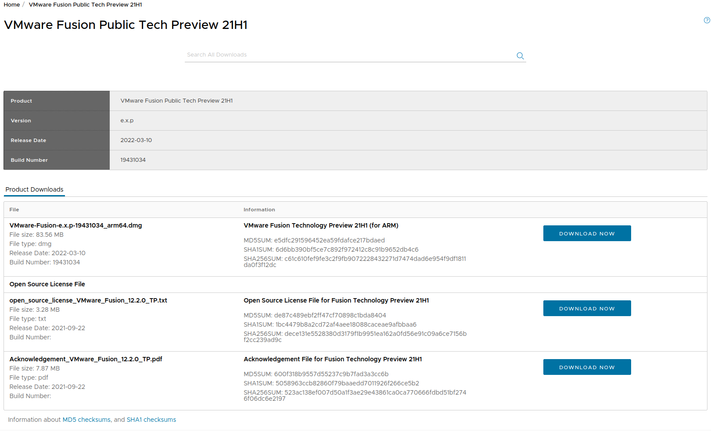
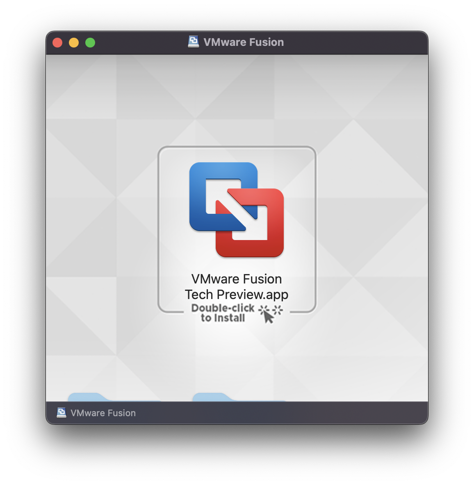

At the time of writing VMWare is still offering Apple Silicon support through their Public Tech Preview for free. This is subject to change when Apple Silicon support is added to their main lineup, however until then the steps to get started are pretty straightforward.

We will first go to [Get Fusion M1](https://www.vmware.com/go/get-fusion-m1) which will auto-redirect us to the most current Tech Preview. From here we will want to download the first file, which is the `.dmg`.

After it downloads we will just double-click on the file and we are presented with the following:

We will double-click on this and after following the prompts we are all done and can use VMWare's Public Tech Preview like normal.