This guide is for virtualize Kali Linux inside of VMware, allowing you to have a Kali VM. This is a great way to use Kali, as it is completely separate from the host, allows you to interact with other VMs (as well as the host, and other machines on the network), and revert to snapshots.

You may wish to follow our other guide, if you are wanting to install VMware on Kali Linux (as a [host](/docs/virtualization/install-vmware-workstation-player-kali-host/)).

The guide below is what we use to generate our [pre-made Kali Linux VMware images](https://www.offensive-security.com/kali-linux-vm-vmware-virtualbox-image-download/) which we put out. You may alter this to your needs. We always generate the images using the latest version of VMware workstation, as Player & fusion doesn't have the same level of functionally and controls over settings.

Upon starting up VMware workstation, press "Create a New Virtual Machine".

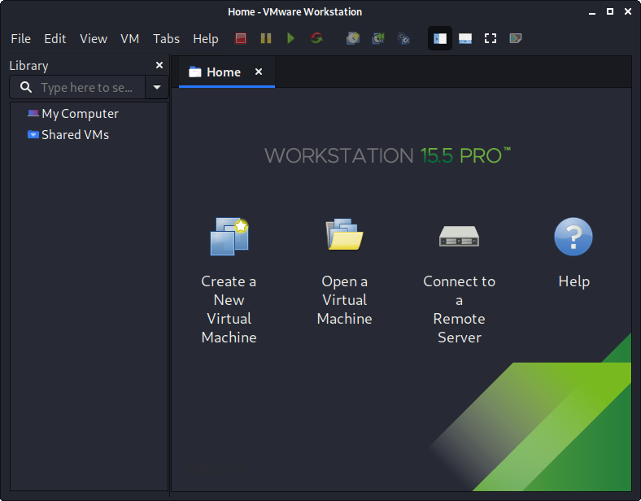

When you have the option, select "Custom '(advanced)'" for the Virtual Machine Configuration, as this will allow us to have more control over the creation of the VM.

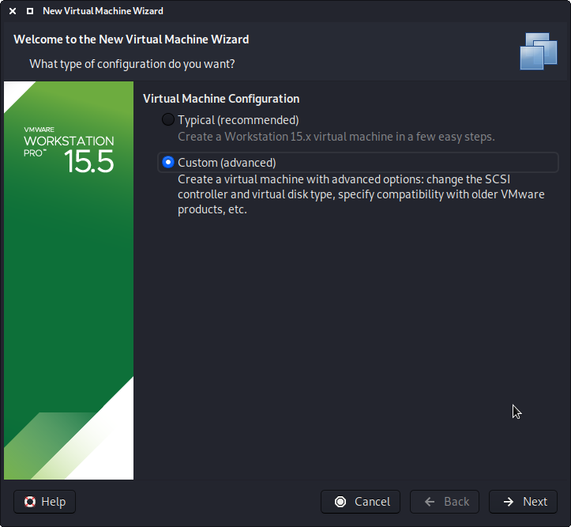

The next screen is "Virtual Machine Hardware Compatibility", which we use "Workstation 8.x". This allow for more users to benifit from Kali out of the box (without having to edit the `.vmx` file to downgrade). If you are using a later version of VMware, upon start up, it will prompt about upgrading the VM. This will remove any limitation due to older VMware profile. However, most users have not got their Kali VM using all these resources, so they wouldn't benefit from having the latest profile. This is why we ship with a older profile.

This screen, we select the Kali Linux image to use to install from. We select "Browse", and navigate to the location of the ISO that we [downloaded](https://www.kali.org/downloads/).

When you see the "Guest Operating System" screen, select "Linux", and then the latest version of Debian for the version (as [Kali is based on Debian](/docs/policy/kali-linux-relationship-with-debian/)). In this example, its Debian 10. We are going to be use the x64 image to install Kali, so we have selected 64-bit.

The next screen is "Virtual Machine Name", which is where you name the VM. This is also used for the filename too (such a the configuration, hard disk and snapshot - which isn't changed from this point). We are keeping it generic in this guide (as Kali is a rolling distribution, and we update it) , however for our releases, we use the version as its a fixed release _(`Kali-Linux-YYYY.N-vmware-ARCH`. Example: `Kali-Linux-2020.2-vmware-amd64`)_.

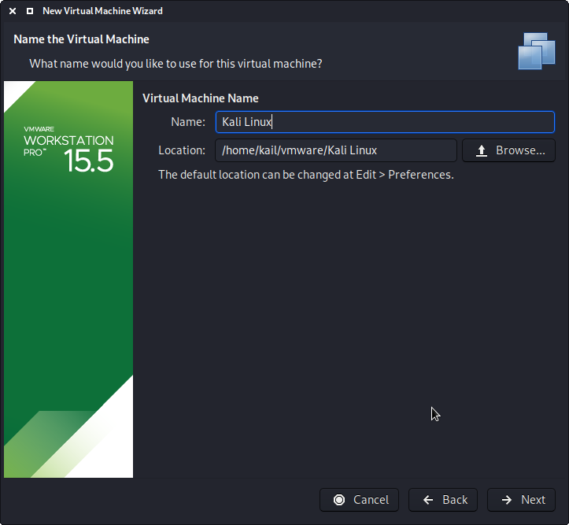

The next screen is "Processors". Here we can start to define how much resources we give the VM. THe higher amount of resources given, Kali will be able to perform more tasks simultaneous and quicker actions. We select "2 processors" and "2 cores per processors", giving a total of 4 cores. You may wish to use more or less depending on your system requirements.

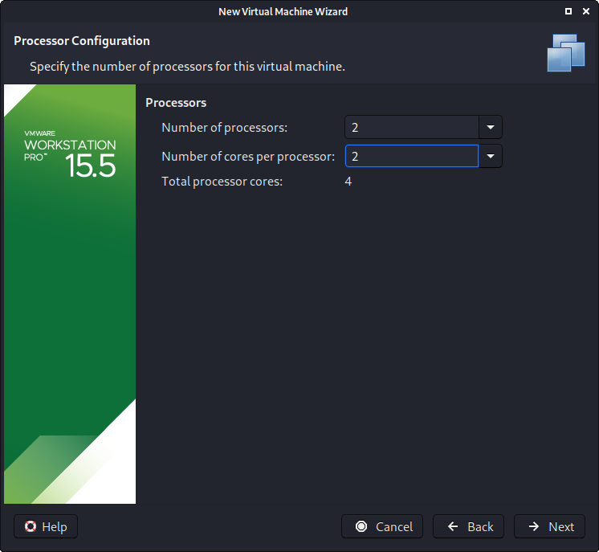

"Memory" is the next section, where we can define how much RAM now to use. Again, the higher amount of RAM, the more application can be open and their performance will increase. Various tools inside of Kali, can be demanding. When we make the general VMs, we select 2GB (2048 MB) for RAM, but we often increase this for our personal machines as we have high performing devices with spare RAM which Kali can utilise.

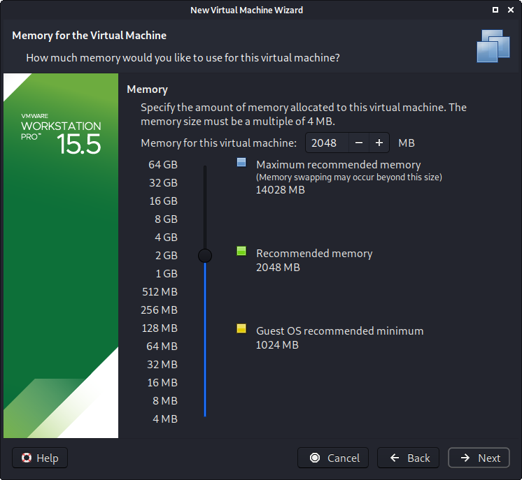

We are then presented with "Network Connection". We default to using a NAT connection. However, this can easy be altered (even when the VM is powered on). This allows for Kali VM to talk to the Internet, as well as the rest of the LAN connection, without it taking up an additional IP address. The down side to this is, it will not be able to receive reverse shells (without port forwarding inside of VMware).

Next is "I/O Controller Types". We accept the default value of "LSI Logic".

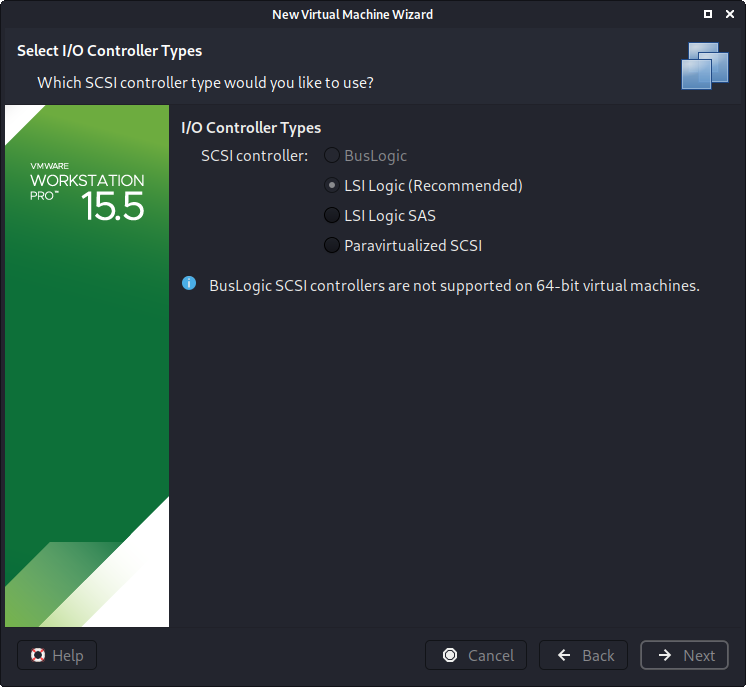

Next is "Virtual Disk Type". We accept the default value of "SCSI".

The following screen is "Disk", which allows us to "create a new virtual disk".

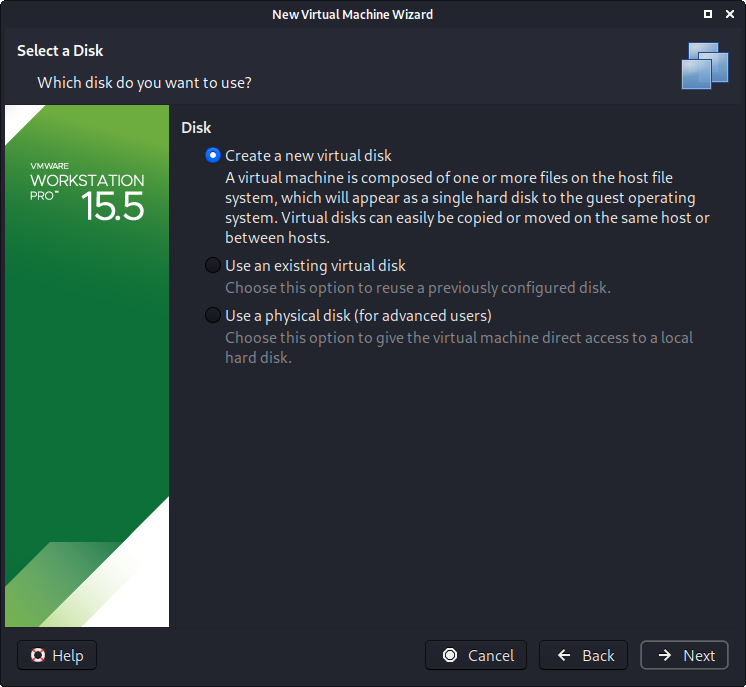

This screen below, "Disk Size", allows us to define how large the virtual hard disk will be. We use "80 GB" for our VMs.

We also don't have it in a single file, but instead "Split virtual disk into multiple files". The VM hard disk will grow over time, to the maximum size, as we do not enable the "Allocate all disk space".

It is possible to increase/decrease the hard disk after the VM has been created, however, if you have installed Kali, you'll need to then then also grown or shrink the partition for the space then to reflexed.

When it comes to the "Disk File" screen, we accept the default value, which has been defined from our VM name earlier in the setup process

We are then presented the final screen for the VM setup wizard, which gives us an overview of the settings we picked.

We are happy with whats shown to us, so we then press "Finish". If you try and "Customize Hardware" at this stage, before the VM is fully created, not every setting is visible.

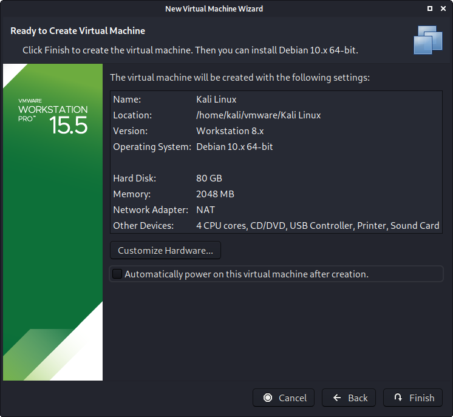

If this is the first time using the wizard, you may have the following prompt explaining how installing "[VMware tools](/docs/virtualization/install-vmware-tools-kali-guest/)" will give you a better experience when using the VM.

After reading and understanding the page, you may wish to tick the "Don't show this page again", fore pressing close.

Before we start up the VM, we now edit its settings, by pressing "Edit virtual machine settings".

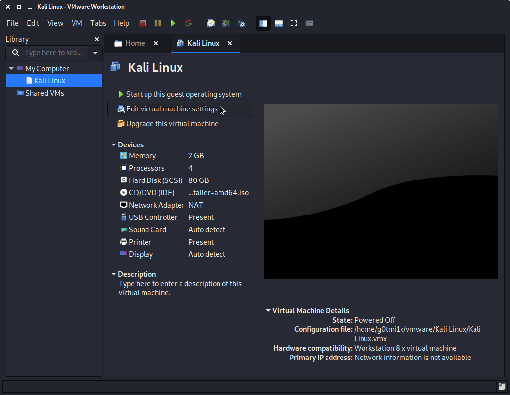

We do not have a use for a printer, so we remove that. To navigate to that section, and then press "Remove".

You may wish is in the "USB" part, to alter how USB devices behave. By disabling "Automatically connect new USB devices", as well as enabling "Show all USB input devices"

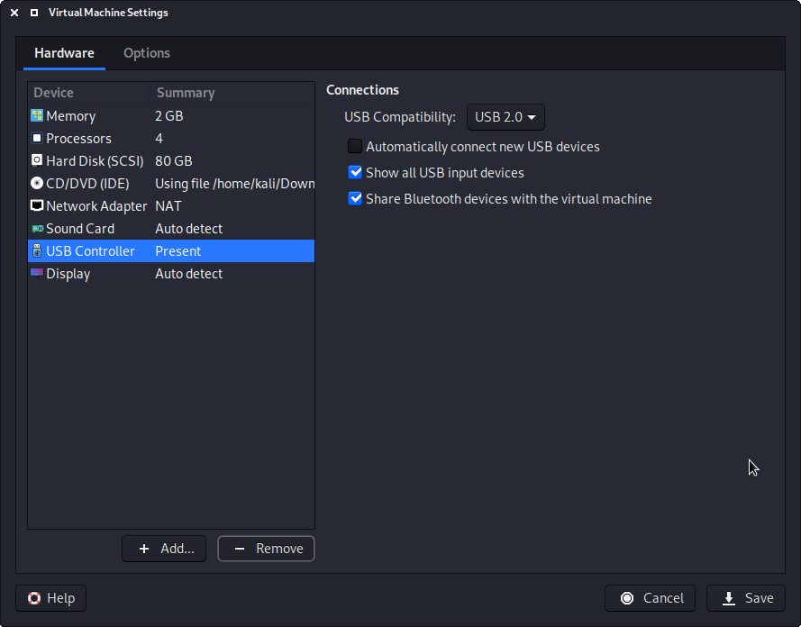

Another item to point out is in the "Display" section, and to make sure that "Accelerated 3D graphics" is disabled, as people have reported that causes issues.

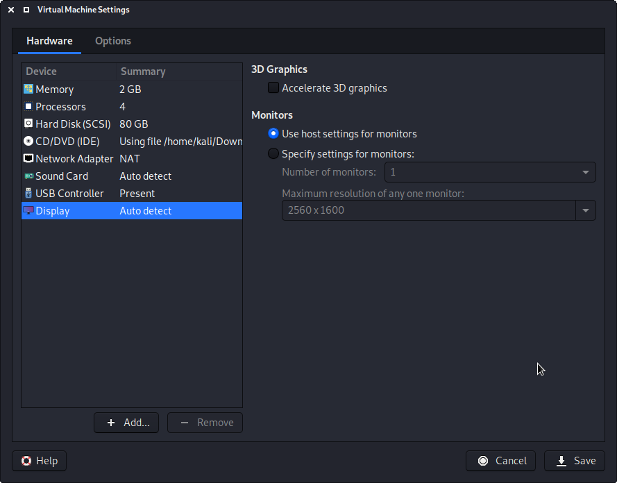

We then move over to the "Options" tab, and move down to "Power". We choose to enable "Report battery information to guests", as it is a handy thing for users who use Kali on a laptop/notebook.

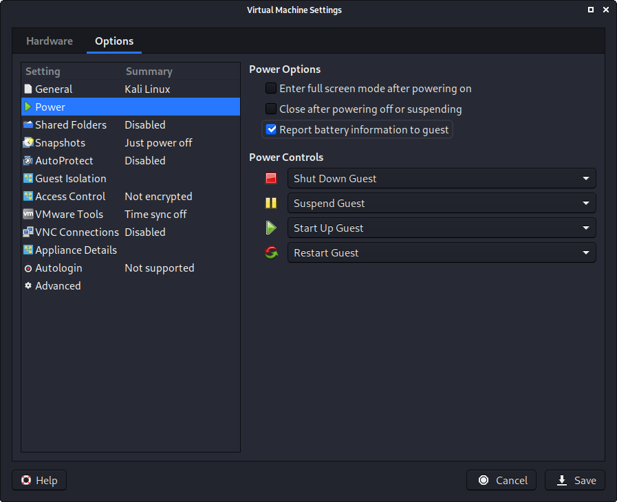

"Shared folders", we select "Always enable", but at this stage, do not share any paths, as some users may not wish for it.

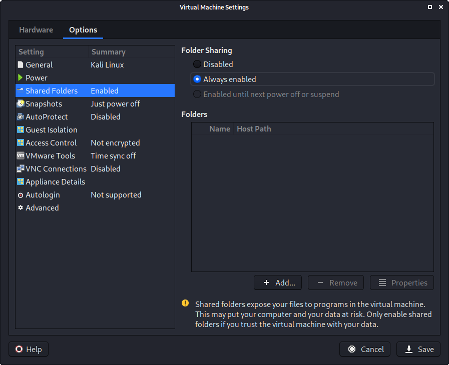

The final option we alter is "VMware Tool", where we enable "Synchronize guest time with host".

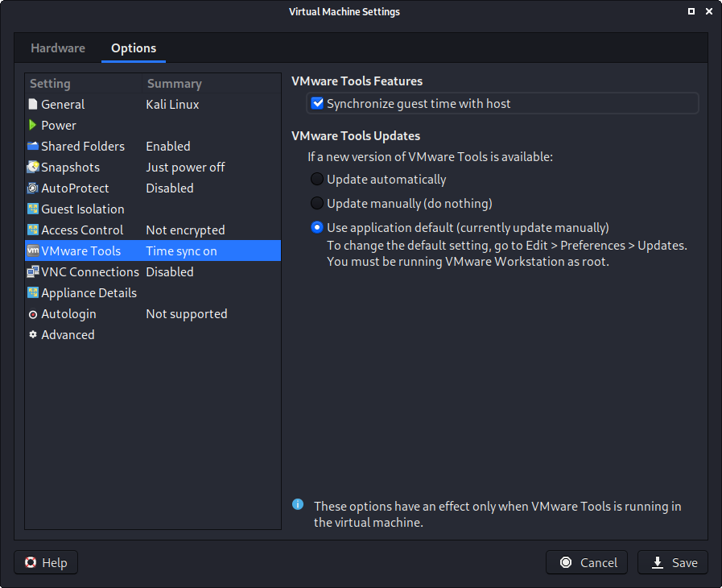

After all this is done, we Save, start up the VM, and then continue installing Kali as we normally would on bare metal install.
