You can install VMware workstation or player on Kali Linux, allowing you to use virtual machines inside of Kali. However if you wish to use Kali as a virtual machine, you want our [Kali Linux Guest VMware](/docs/virtualization/install-vmware-workstation-player-kali-guest-vm/) page.

Before trying to install VMware, please make sure your version of Kali is up-to-date, and required, reboot the machine.

```
kali@kali:~$ sudo apt update
kali@kali:~$ sudo apt dist-upgrade -y
kali@kali:~$ [ -f /var/run/reboot-required ] && sudo reboot -f
```

To start with, you will need to download VMware. You can do this by going to [VMware's download page](https://www.vmware.com/uk/products/workstation-pro/). At the time of writing, the latest version is `15.5.1-15018445`.

Alternatively, you can do the following command line method:

```
kali@kali:~$ sudo apt install -y curl
kali@kali:~$
kali@kali:~$ cd Downloads/
kali@kali:~/Downloads$ curl -L https://www.vmware.com/go/getworkstation-linux > vmware.bin
kali@kali:~/Downloads$
kali@kali:~/Downloads$ file vmware.bin
vmware.bin: a /usr/bin/env bash script executable (binary data)
kali@kali:~/Downloads$
kali@kali:~/Downloads$ ls -lah vmware.bin
-rwxr-xr-x 1 kali kali 511M Feb 14 20:46 vmware.bin
kali@kali:~/Downloads$
```

When everything is up-to-date, and ready to go, make sure the file is executable and then call it.

```
kali@kali:~$ cd Downloads/
kali@kali:~/Downloads$ chmod +x VMware-Workstation-Full-15.5.1-15018445.x86_64.bundle
kali@kali:~/Downloads$ sudo ./VMware-Workstation-Full-15.5.1-15018445.x86_64.bundle
Extracting VMware Installer...done.
Installing VMware Workstation 15.5.1
    Configuring...
[######################################################################] 100%
Installation was successful.
kali@kali:~/Downloads$
```
After the installer is installed, you should be able to just run `vmware` to continue setup.

```
kali@kali:~/Downloads$ vmware
```

At this point, you should be be straight forward, often just clicking through.

The first part may be VMware Kernel Modules:

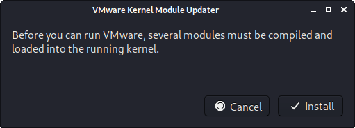

If `vmware` wasn't called with superuser privileges, you may be prompted for a password:

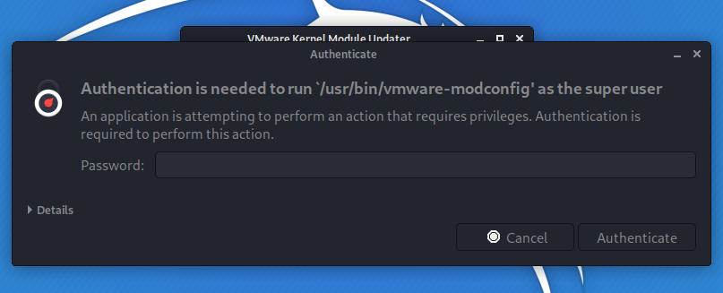

At this point, it may not install correctly, and get the error message: `Unable to install all modules. See log /tmp/vmware-kali/vmware-*.log for details. (Exit code 1)`. This is often due to Kali's kernel being newer than what VMware is expecting. Looking at the log may help with troubleshooting the issue as well as the guide at the end of this post.

You will need to accept the legal agreement:

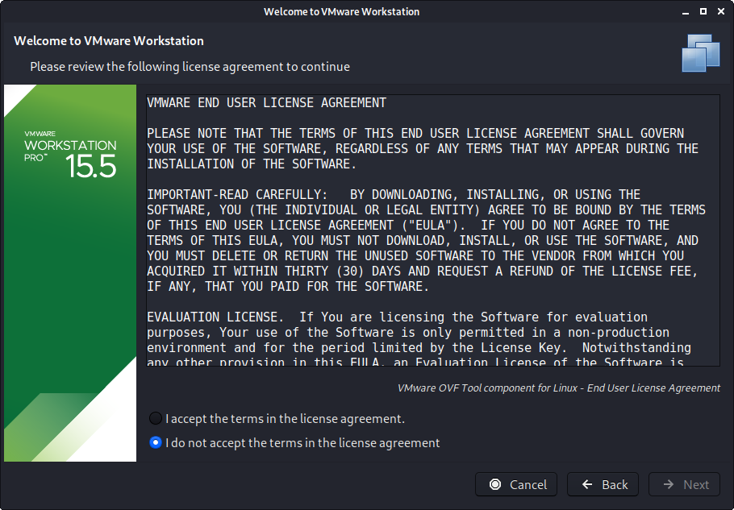

You may wish for it VMware to check for any updates:

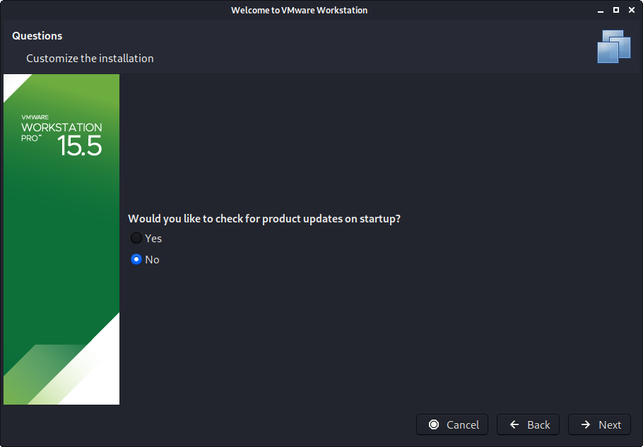

You may wish to join "VMware Customer Experience Improvement Program":

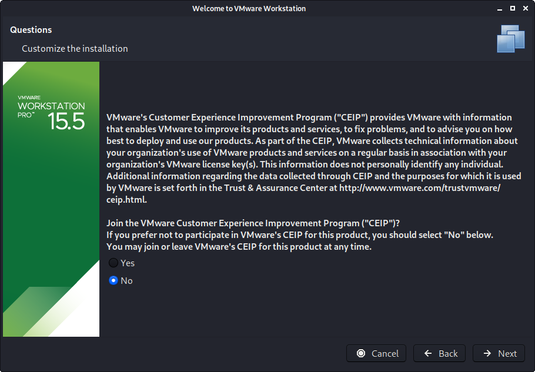

Enter the current username:

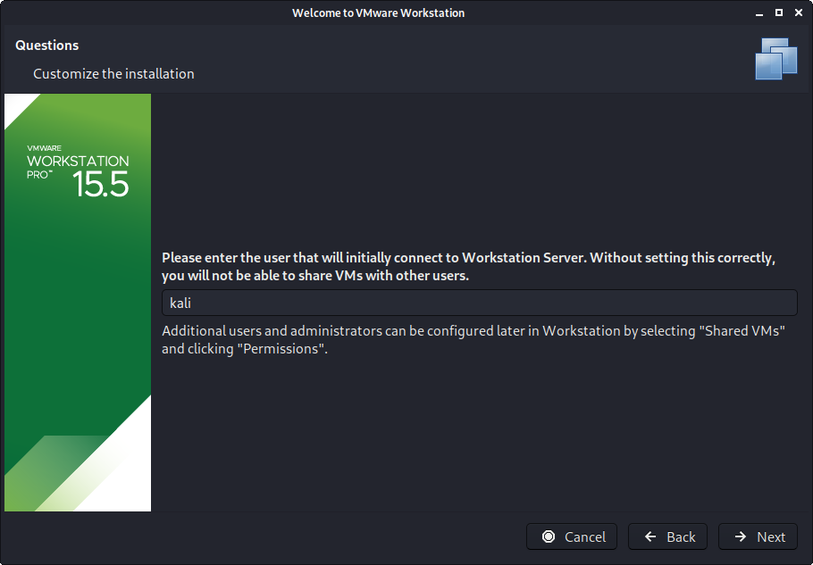

Enter a location for Shared VMs (this is different to each users own VMs):

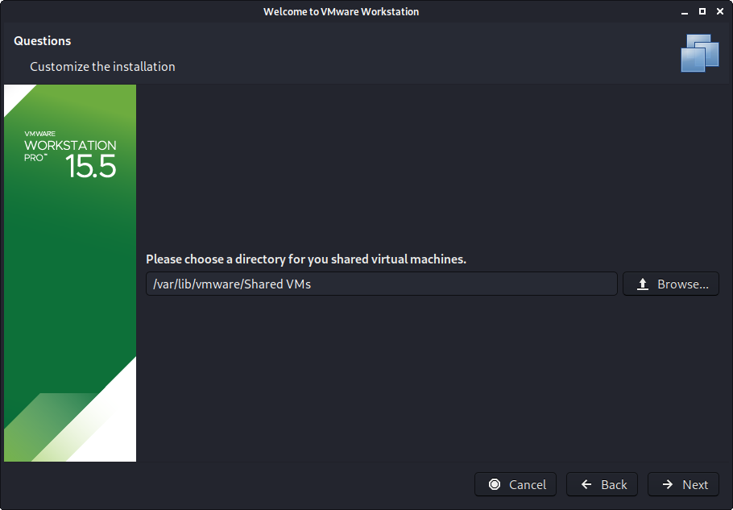

Enter a port for HTTPS access


If you have a product key, you can enter it now, else it will be a trial for 30 days:

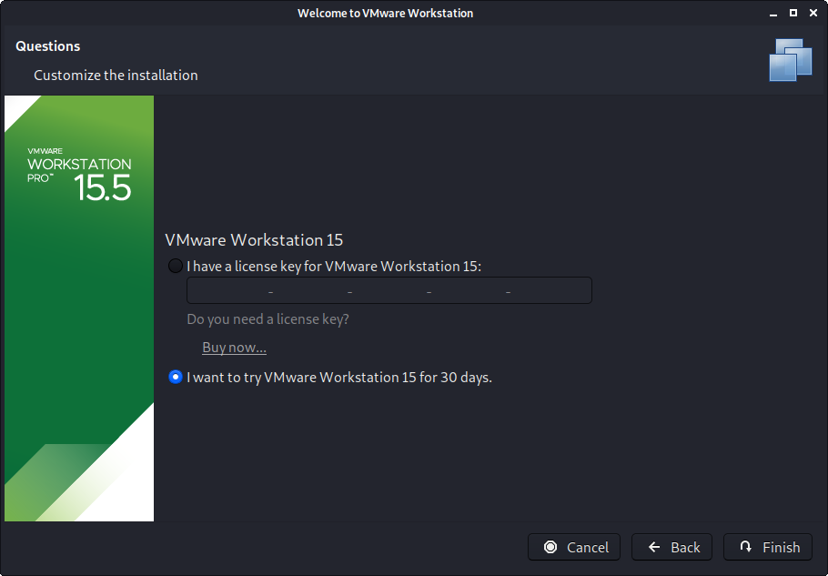

You may be once again prompt for superuser privileges if you didn't execute the setup file with it:

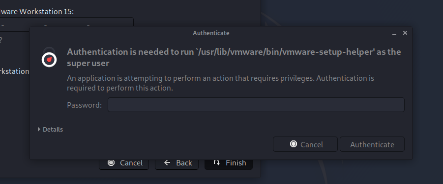

The final screen should look like this:

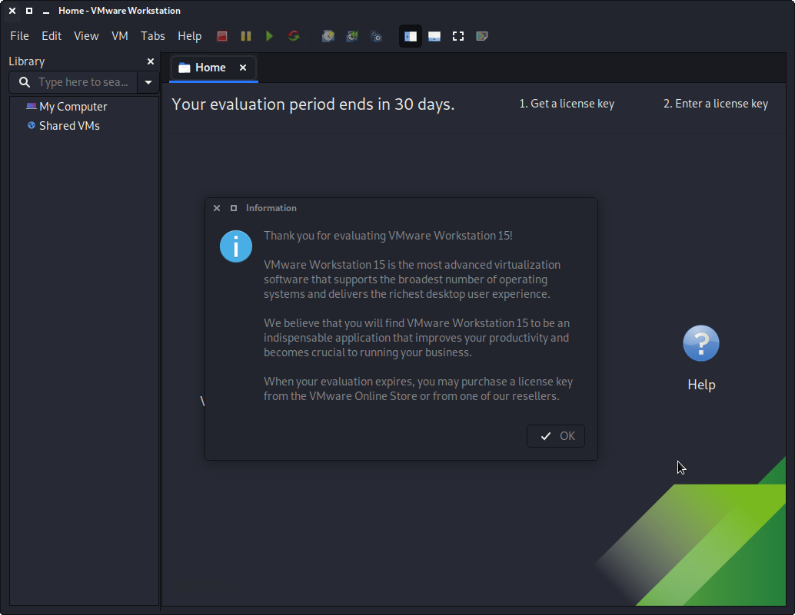

## When things go wrong

### Packages

From time to time, things may not go right. There could be a number of reasons why VMware may not install. The first thing to check would be you have all the necessary packages installed:

```
kali@kali:~$ sudo apt install -y build-essential linux-headers-$( uname -r ) vlan
```

Try running `vmware` again, and see if now setup continues.


### vmware-modconfi

If it is still unsuccessful, we can dig a little further by running the following:

```
kali@kali:~$ sudo vmware-modconfig --console --install-all
kali@kali:~$ sudo vmware-modconfig --console --install-all 2>&1 | grep error
```

Looking at the output, may either give us the exact issue, or at the very least something to search the Internet for.


### vmware-host-modules

A common issue is because the setup file for VMware isn't supporting the latest kernels, which could be an issue as Kali is a rolling distribution and receives frequent updates. If this is the case, we can patch VMware modules to support this.

```
kali@kali:~$ sudo apt install -y git
kali@kali:~$ git clone https://github.com/mkubecek/vmware-host-modules.git
kali@kali:~$ cd vmware-host-modules/
kali@kali:~$ git checkout workstation-15.5.1
kali@kali:~$ make
kali@kali:~$ sudo make install
```

Try now to install VMware. If you are still having issues, you may need to restart your Kali before trying one more final time.

- - -

### Powering On

You may also face the following issues, when trying to power on a VM:

- "Failed to initialize monitor device"
- "Could not open /dev/vmmon: No such file or directory. Please make sure that kernel module 'vmmon' is loaded"
- "Unable to change virtual machine power state: Transport (VMDB) error -14: Pipe connection has been broken."

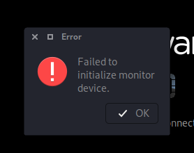
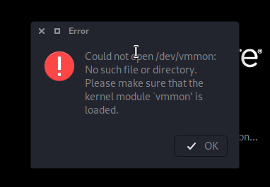
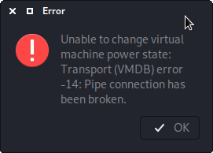

The quickest solution to fix these would be to reboot Kali and try again.

- - -

### libaio

If you see the following problem, upon trying to run VMware:

```
kali@kali:~$ vmware
[AppLoader] Use shipped Linux kernel AIO access library.
An up-to-date "libaio" or "libaio1" package from your system is preferred.
```

Try installing the [libaio1](https://packages.debian.org/testing/libaio1) package:

```
kali@kali:~$ sudo apt install -y libaio1
```
