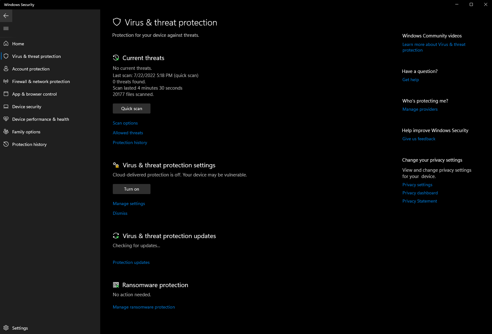
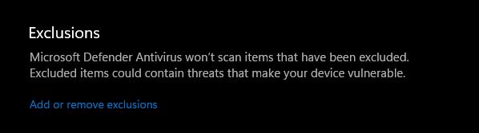
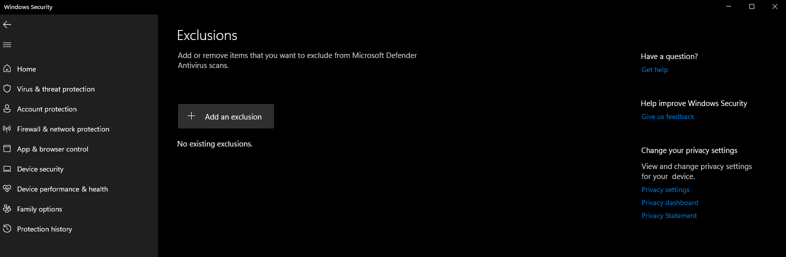
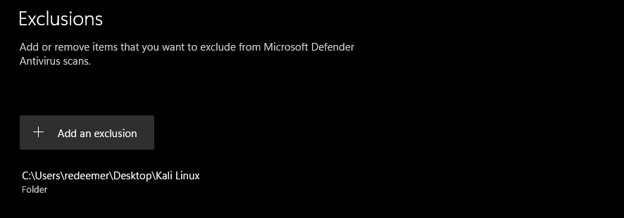

시간이 지남에 따라 안티바이러스와 EDR 프로그램들은 해킹 도구를 식별하기 위한 새로운 기능들을 구현하고 있어요. 이러한 해킹 도구들은 보통 호스트 운영 체제가 감염되는 것을 방지하기 위해 안티바이러스 프로그램에 의해 시그니처(특성 정보)가 등록돼요. 칼리 리눅스에 포함된 많은 도구, 익스플로잇, 리소스들이 이러한 안티바이러스 제품들에 의해 시그니처가 등록되어 있어요. 그렇다면 시그니처 기반 탐지는 어떻게 작동할까요?

안티바이러스 시그니처는 프로그램 내에 포함된 바이트 시퀀스예요. 호스트 시스템의 파일들이 스캔되고 안티바이러스 프로그램은 이러한 시그니처를 포함하는 데이터베이스와 비교하여 일치하는지 확인해요. 일치하는 것이 발견되면 해당 파일은 격리되고 호스트 시스템에서 제거돼요.

안티바이러스 프로그램이 자신의 역할을 수행하고 있지만, 호스트 안티바이러스 소프트웨어에 의해 칼리 리눅스 가상 머신이 격리되는 것을 방지하는 몇 가지 방법이 있어요. 이 과정은 Windows 보안에서 이러한 예외 항목을 구현하는 데 중점을 둘 거예요:

## Windows 보안에서 예외 폴더 설정하기

{}
이 과정은 Windows 10과 Windows 11에서 작동해요
{}

Windows에서는 예외 목록에 가상 머신을 추가하여 Windows 보안이 알림을 표시하거나 가상 머신을 차단하는 것을 방지할 수 있어요. 이를 위해서는 다음과 같이 진행해야 해요:

1. "시작" > "설정" > "업데이트 및 보안" > "Windows 보안" > "바이러스 및 위협 방지"를 선택하세요.

2. "바이러스 및 위협 방지 설정" 아래에서 "설정 관리"를 선택하고, "예외" 아래에서 "예외 추가 또는 제거"를 선택하세요.

3. "예외 추가"를 선택하세요. 드롭다운 메뉴가 나타나면 파일, 폴더, 파일 유형 또는 프로세스를 선택할 수 있어요. 폴더를 선택하면 예외가 해당 폴더 내의 모든 하위 폴더에도 적용돼요.

4. 칼리 리눅스 가상 머신을 실행하는 데 필요한 파일을 포함할 폴더를 선택하세요. (이 상황에서는 내 데스크톱에 만든 폴더에 칼리 리눅스 가상 머신을 저장하고 싶어요.)

이제 폴더가 예외로 설정되었으므로 Windows 보안은 칼리 리눅스 가상 머신이 포함된 폴더를 스캔하지 않을 거예요.

## 참고 자료
- https://support.microsoft.com/ko-kr/windows/windows-보안에-예외-추가-811816c0-4dfd-af4a-47e4-c301afe13b26
