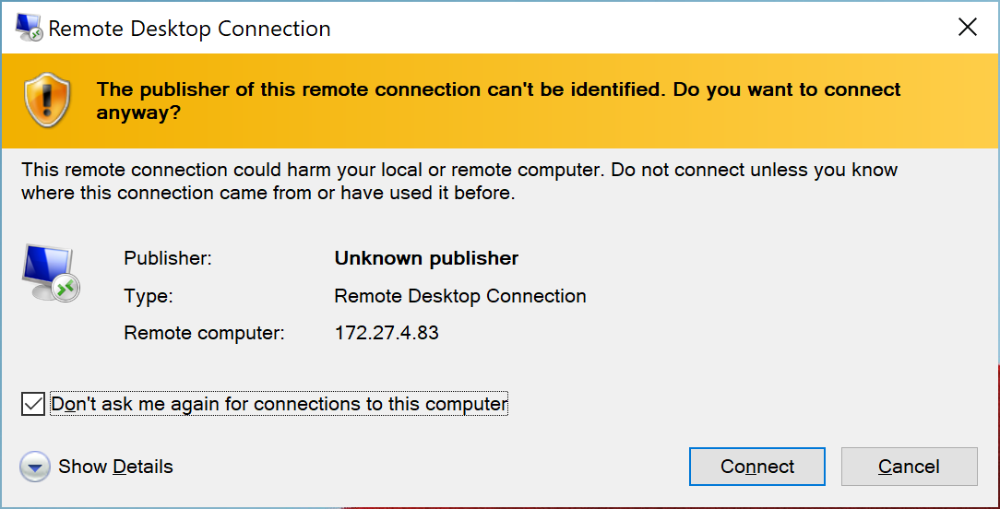
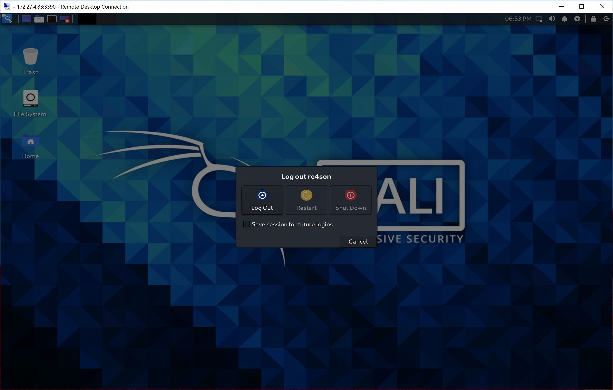

향상된 세션 모드(ESM)의 Win-KeX는 Windows 네이티브 프로토콜과 클라이언트를 사용하여 별도의 창에서 Kali Linux 데스크톱 세션을 실행합니다. ESM 모드는 ARM 기기에서 유일하게 지원되는 모드입니다.

ESM 모드는 Windows와 Kali 환경을 시각적으로 분리하는 데 도움이 됩니다.

Win-KeX는 [xrdp](http://xrdp.org/) 서버와 Microsoft의 네이티브 원격 데스크톱 프로토콜(RDP) 클라이언트를 활용합니다.

Microsoft 네이티브 클라이언트를 사용하면 HiDPI 기기에서 더 선명한 GUI를 얻을 수 있습니다. 단점은 픽셀 밀도가 증가하여 [--win](/docs/wsl/win-kex-win/) 또는 [--sl](/docs/wsl/win-kex-sl/) 모드만큼 빠르지 않다는 것입니다.

## 사용법

### 세션 시작하기

- WSL에서 Kali 실행
- 일반 사용자로 ESM 모드와 사운드를 함께 Win-KeX를 시작하려면: `kex --esm --sound`
**참고**: 이 글을 작성하는 시점에서 ARM용 Windows에는 `localhost` 대신 IP 주소를 사용하여 Kali 컨테이너에 연결할 때 심각한 패킷 손실을 일으키는 버그가 있습니다. 해결 방법으로 ARM 기기에서 `--ip` 명령줄 스위치를 사용하세요. 예: `kex --esm --ip --sound`

`--ip`를 사용하는 단점은 기기를 다시 시작할 때마다 ESM 비밀번호를 다시 입력해야 한다는 것입니다. 이는 자격 증명이 세션 이름을 사용하여 저장되는데, 이 이름이 재부팅 후 변경되기 때문입니다. Microsoft가 이 버그를 해결하면 `--ip`를 제거하고 다시는 비밀번호를 입력하지 않아도 될 것입니다.

**참고**: ESM 모드는 ARM 기기에서 기본 Win-KeX 모드이므로, Windows on ARM을 실행 중이라면 이 페이지의 모든 명령에서 `--esm`을 생략할 수 있습니다.

- 처음 실행 시 RDP 서버 비밀번호를 설정하라는 메시지가 표시됩니다. 이는 로그인하려는 kali 사용자의 비밀번호입니다. 비밀번호는 Windows 자격 증명 저장소에 저장되며 나중에 `kex --esm --passwd`를 통해 변경할 수 있습니다.

"다시 묻지 않음"을 체크하고 다음 경고를 확인하세요:

이렇게 하면 Win-KeX 서버가 시작되고 전체 화면 모드로 Win-KeX 클라이언트가 실행됩니다:

### 루트 세션 시작하기

- 윈도우 모드에서 루트로 Win-KeX를 시작하려면: `sudo kex --esm`
- 처음 실행할 때 ESM 서버 비밀번호를 설정하라는 메시지가 표시됩니다. 이는 kali 루트 사용자의 비밀번호입니다.
  - 비밀번호는 나중에 `sudo kex --esm --passwd`를 통해 변경할 수 있습니다.

이렇게 하면 루트로 Win-KeX 서버가 시작되고 전체 화면 모드로 Win-KeX 클라이언트가 실행됩니다.

### 사운드 지원

- Win-KeX는 펄스 오디오 지원을 포함합니다
- 사운드 지원으로 Win-KeX를 시작하려면 `--sound` 또는 `-s`를 추가하세요. 예: `kex --esm --sound`

### 세션 관리

- RDP 클라이언트를 닫아 활성 세션에서 연결을 해제할 수 있습니다. 이렇게 하면 클라이언트는 닫히지만 세션은 백그라운드에서 계속 실행됩니다
- `kex --esm --start-client`를 입력하여 세션에 다시 연결할 수 있습니다

### 세션 중지하기

- Win-KeX 클라이언트를 닫으려면 Kali GUI 세션에서 로그아웃하세요

- Win-KeX ESM 모드를 완전히 종료하려면 다음을 입력하세요: `kex --esm --stop`

Win-KeX를 즐기세요!
