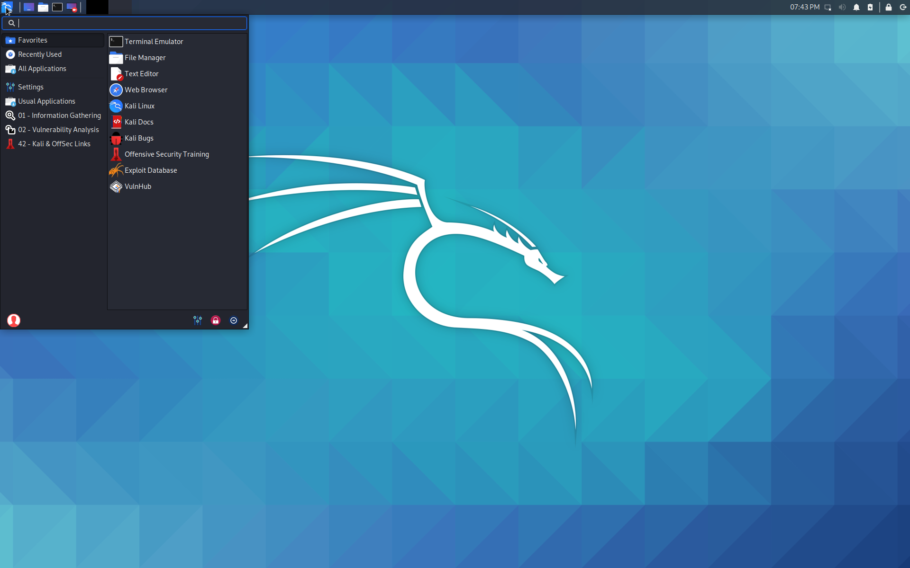

## 개요

윈도우 모드의 Win-KeX는 별도의 창에서 Kali Linux 데스크톱 세션을 실행해요.

윈도우 모드는 Windows와 Kali 환경을 시각적으로 구분하는 데 도움이 돼요.

Win-KeX는 클라이언트와 서버 구성 요소에 [TigerVNC](https://tigervnc.org/)를 활용해요.

## 사용법

### 세션 시작하기

- 윈도우 모드에서 일반 사용자로 Win-KeX 시작하기: `kex --win`
  - 또는 간단히: `kex`
  - **참고**: 윈도우 모드는 기본 Win-KeX 모드이므로 이 페이지의 모든 명령어에서 `--win`은 생략 가능해요.

- 첫 실행 시 VNC 서버 비밀번호를 설정하라는 메시지가 표시돼요.
  - 비밀번호는 나중에 `kex --passwd`로 변경할 수 있어요.

이렇게 하면 Win-KeX 서버가 시작되고 Win-KeX 클라이언트가 전체 화면 모드로 실행돼요:

### 루트 세션 시작하기

- 윈도우 모드에서 루트로 Win-KeX 시작하기: `sudo kex --win`
- 첫 실행 시 VNC 서버 비밀번호를 설정하라는 메시지가 표시돼요.
  - 비밀번호는 나중에 `sudo kex --passwd`로 변경할 수 있어요.

이렇게 하면 Win-KeX 서버가 루트로 시작되고 Win-KeX 클라이언트가 전체 화면 모드로 실행돼요.

**참고**: Win-KeX 클라이언트는 루트 세션에 연결할 때 항상 VNC 서버 비밀번호를 요구해요.

### 세션 관리

- **F8**을 누르면 클라이언트의 컨텍스트 메뉴가 열려요. 이를 통해 클라이언트 세션 관리(예: 클라이언트 닫기, 전체 화면과 창 모드 전환 등)를 할 수 있어요.
- **F8** -> Exit viewer를 눌러 활성 세션에서 연결을 끊을 수 있어요. 이렇게 하면 클라이언트는 닫히지만 세션은 백그라운드에서 계속 실행돼요.
- `kex --win --start-client`를 입력하여 세션에 다시 연결할 수 있어요.

### 사운드 지원

- Win-KeX는 펄스 오디오 지원을 포함하고 있어요.
- 사운드 지원으로 Win-KeX를 시작하려면 `--sound` 또는 `-s`를 추가하세요. 예: `kex --win --sound`
- 처음으로 사운드 지원으로 Win-KeX를 시작할 때, 윈도우 디펜더 방화벽을 통한 트래픽 허용 권한을 요청받으면 **공용 네트워크**를 선택해야 해요.

### 멀티스크린 지원

- Win-KeX는 멀티스크린 설정을 지원해요:
  **F8**을 누르고 옵션 -> 화면으로 이동해요. 그런 다음 "모든 모니터에서 전체 화면 모드 활성화" 및 "전체 화면 모드" 체크를 해제하고, Win-KeX를 원하는 화면으로 이동한 후 전체 화면 모드를 다시 활성화하세요.

### 세션 중지하기

- Win-KeX 클라이언트를 닫으려면 **F8**을 누르고 "Exit viewer"를 선택하세요.
- 필요한 경우 Win-KeX 윈도우 모드를 종료하려면 다음을 입력하세요: `kex --win --stop`

Win-KeX를 즐겨보세요!
