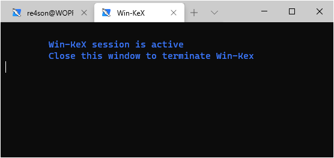

## Content:

- [Overview](#overview)
- [Installation](#installation)
  - [Prerequisites](#prerequisites)
  - [Install Kali Linux in WSL2](#install-kali-linux-in-wsl2)
  - [Install Win-Kex](#install-win-kex)
- [Run Win-KeX](#run-win-kex)
- [Optional steps](#optional-steps)

&nbsp;

## Overview

#### We are going to install Kali Linux in Windows Subsystem for Linux (Version 2) with win-kex (Kali Desktop Experience for Windows) in under 2 minutes.


&nbsp;

## Installation

All installation steps, up to the point where we install Win-Kex, are also explained in the 5 minute video guide by the amazing [NetworkChuck](https:/twitter.com/NetWorkChuck):

[Kali Linux on Windows in 5min (WSL2 GUI)](https://www.youtube.com/watch?v=AfVH54edAHU)

Note: You can skip the installation of xrdp and follow [the last step of this guide](#install-win-kex) to install Win-Kex instead.

&nbsp;

### Prerequisites

- Running Windows 10 version 2004 or higher

### Install Kali Linux in WSL2

- Open PowerShell as administrator and run:

  ```
  Enable-WindowsOptionalFeature -Online -FeatureName Microsoft-Windows-Subsystem-Linux
  ```

- Restart

- Open PowerShell as administrator and run:

  ```
  dism.exe /online /enable-feature /featurename:VirtualMachinePlatform /all /norestart
  dism.exe /online /enable-feature /featurename:Microsoft-Windows-Subsystem-Linux /all /norestart
  ```

- Restart

- Download and install the WSL2 Linux Kernel from here: https://aka.ms/wsl2kernel

- Open PowerShell as administrator and run:
`wsl --set-default-version 2`

- Install Kali Linux from the Microsoft Store

  Note: to upgrade an existing WSL1 kali-linux installation, type:
  `wsl --set-version kali-linux 2`

- Run Kali and finish the initial setup

&nbsp;

### Install Win-KeX

- Install win-kex via:
  `sudo apt update && sudo apt install kali-win-kex`

&nbsp;

## Run Win-KeX

- Run win-kex via:
`kex`

  

&nbsp;

## Optional Steps:

- If you have the space, why not install "Kali with the lot"?:
`sudo apt install kali-linux-large`

  


- Create a Windows Terminal Shortcut

  


  choose one of these options:

  **Basic:**

  ```
  {
        "guid": "{55ca431a-3a87-5fb3-83cd-11ececc031d2}",
        "hidden": false,
        "name": "Win-KeX",
        "commandline": "wsl kex wtstart",
  },
  ```


  **Advanced - Kali icon and start in kali home directory:**

  Copy the kali-menu.png icon across to your windows picture directory and add the icon and start directory to your WT config:

  ```
  {
          "guid": "{55ca431a-3a87-5fb3-83cd-11ececc031d2}",
          "hidden": false,
  		"icon": "file:///c:/users/<windows user>/pictures/icons/kali-menu.png",
          "name": "Win-KeX",
          "commandline": "wsl kex wtstart",
  		"startingDirectory" : "//wsl$/kali-linux/home/<kali user>"
  },
  ```

  

  

  Tip: If you are running different linux distributions in WSL, you can force to run win-kex in Kali by changing the command line to:
  `"commandline": "wsl -d kali-linux kex wtstart",`

  

&nbsp;

#### Enjoy Win-KeX!