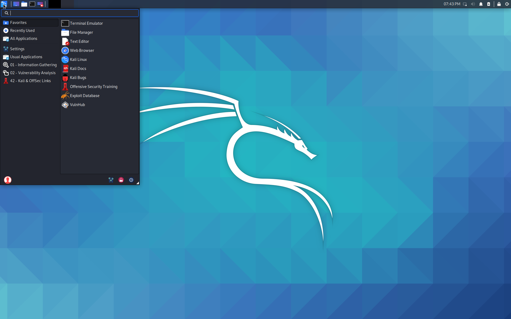
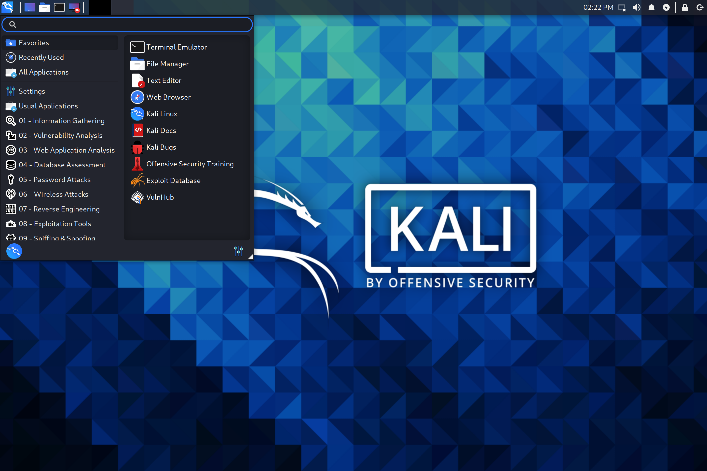
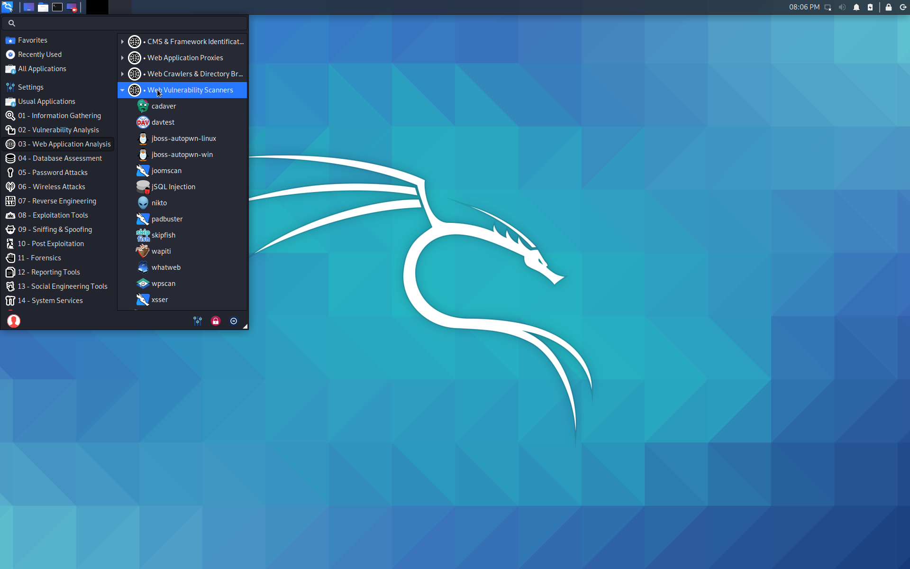

Win-KeX는 Windows Subsystem for Linux (WSL 2)에서 Kali Linux의 GUI 데스크톱 환경을 다음과 같은 기능으로 제공합니다.

- [윈도우 모드](/docs/wsl/win-kex-win/): 전용 창에서 Kali Linux 데스크톱 실행 <!-- VNC/tigervncserver -->
- [심리스 모드](/docs/wsl/win-kex-sl/): Windows와 Kali 애플리케이션 및 메뉴 간에 Windows 데스크톱 공유 <!-- VcXsrv/xfdesktop -->
- [향상된 세션 모드](/docs/wsl/win-kex-esm/): Hyper-V와 유사하게 RDP를 사용하여 더 풍부한 기능 경험 제공 <!-- RDP/xRDP -->
- 사운드 지원 <!-- pulse -->
- Kali Linux와 Windows 간의 복사 및 붙여넣기 지원을 위한 공유 클립보드
- 루트 및 일반 사용자 세션 지원
- 다중 세션 지원: 루트 윈도우, 일반 사용자 윈도우, 심리스 세션 동시 실행
- WSLg와 완벽하게 호환


이 페이지에서는 2분 이내에 Win-KeX를 설치하는 단계를 자세히 설명합니다.

## 설치

Win-KeX를 설치하는 지점까지의 모든 설치 단계는 [NetworkChuck](https://twitter.com/NetWorkChuck)의 5분 비디오 가이드에서도 설명되어 있습니다: [Windows 10에서 새로운 Kali Linux GUI (WSL 2) // 2020.3 릴리스](https://www.youtube.com/watch?v=dgdOILL1184)



### 사전 요구 사항

- [WSL 2의 Kali](/docs/wsl/wsl-preparations/)
- [Windows Terminal](https://www.microsoft.com/en-us/p/windows-terminal/9n0dx20hk701)

### Win-KeX 설치

Kali WSL 내에서 다음과 같이 Win-KeX를 설치합니다:

```console
kali@kali:~$ sudo apt update
kali@kali:~$
kali@kali:~$ sudo apt install -y kali-win-kex
```
<!--
> 23 upgraded, 1024 newly installed, 0 to remove and 28 not upgraded.
> Need to get 692 MB of archives.
> After this operation, 2,395 MB of additional disk space will be used.
-->

## Win-KeX 실행

Win-KeX는 다음 세 가지 모드를 지원합니다.

### 윈도우 모드



사운드 지원이 있는 윈도우 모드에서 Win-KeX를 시작하려면 다음 중 하나를 실행하세요:

- Kali WSL 내부에서: `kex --win -s`
- Windows 명령 프롬프트에서: `wsl -d kali-linux kex --win -s`

자세한 내용은 [Win-KeX 윈도우 모드 사용 설명서](/docs/wsl/win-kex-win/)를 참조하세요.

### 향상된 세션 모드



사운드 지원과 ARM 문제 해결이 포함된 향상된 세션 모드에서 Win-KeX를 시작하려면 다음 중 하나를 실행하세요:

- Kali WSL 내부에서: `kex --esm --ip -s`
- Windows 명령 프롬프트에서: `wsl -d kali-linux kex --esm --ip -s`

자세한 내용은 [Win-KeX 향상된 세션 모드 사용 설명서](/docs/wsl/win-kex-esm/)를 참조하세요.

### 심리스 모드


사운드 지원이 있는 심리스 모드에서 Win-KeX를 시작하려면 다음 중 하나를 실행하세요:

- Kali WSL 내부에서: `kex --sl -s`
- Windows 명령 프롬프트에서: `wsl -d kali-linux kex --sl -s`

자세한 내용은 [Win-KeX SL 사용 설명서](/docs/wsl/win-kex-sl/)를 참조하세요.

## 선택적 단계

### Kali의 기본 도구

공간이 충분하다면 "모든 기능이 포함된 Kali"를 설치하는 건 어떨까요? 이렇게 하면 기대했던 Kali의 전통적인 "기본" 도구들도 함께 제공됩니다:

```
sudo apt install -y kali-linux-large
```



### Windows Terminal

[Windows Terminal](https://www.microsoft.com/en-us/p/windows-terminal/9n0dx20hk701) 바로가기 생성:


다음 옵션 중에서 선택하세요:

**사운드 지원이 있는 기본 윈도우 모드의 Win-KeX**:

```plaintext
{
      "guid": "{55ca431a-3a87-5fb3-83cd-11ececc031d2}",
      "hidden": false,
      "name": "Win-KeX",
      "commandline": "wsl -d kali-linux kex --wtstart -s",
},
```

**사운드 지원이 있는 고급 윈도우 모드의 Win-KeX - Kali 아이콘 및 Kali 홈 디렉토리에서 시작**:

`kali-menu.png` 아이콘을 Windows 사진 디렉토리로 복사하고 WT 구성에 아이콘과 시작 디렉토리를 추가하세요:

```plaintext
{
        "guid": "{55ca431a-3a87-5fb3-83cd-11ececc031d2}",
        "hidden": false,
        "icon": "file:///c:/users/<windows user>/pictures/icons/kali-menu.png",
        "name": "Win-KeX",
        "commandline": "wsl -d kali-linux kex --wtstart -s",
        "startingDirectory" : "//wsl$/kali-linux/home/<kali user>"
},
```

- - -

**사운드 지원이 있는 기본 심리스 모드의 Win-KeX**:

```plaintext
{
      "guid": "{55ca431a-3a87-5fb3-83cd-11ececc031d2}",
      "hidden": false,
      "name": "Win-KeX",
      "commandline": "wsl -d kali-linux kex --sl --wtstart -s",
},
```

- - -

**사운드 지원이 있는 고급 심리스 모드의 Win-KeX - Kali 아이콘 및 Kali 홈 디렉토리에서 시작**:

`kali-menu.png` 아이콘을 Windows 사진 디렉토리로 복사하고 WT 구성에 아이콘과 시작 디렉토리를 추가하세요:

```plaintext
{
        "guid": "{55ca431a-3a87-5fb3-83cd-11ececc031d2}",
        "hidden": false,
        "icon": "file:///c:/users/<windows user>/pictures/icons/kali-menu.png",
        "name": "Win-KeX",
        "commandline": "wsl -d kali-linux kex --sl --wtstart -s",
        "startingDirectory" : "//wsl$/kali-linux/home/<kali user>"
},
```

- - -

**사운드 지원이 있는 기본 ESM 모드의 Win-KeX**:

```plaintext
{
      "guid": "{55ca431a-3a87-5fb3-83cd-11ecedc031d2}",
      "hidden": false,
      "name": "Win-KeX",
      "commandline": "wsl -d kali-linux kex --esm --wtstart -s",
},
```

- - -

**사운드 지원이 있는 고급 ESM 모드의 Win-KeX - Kali 아이콘 및 Kali 홈 디렉토리에서 시작**:

`kali-menu.png` 아이콘을 Windows 사진 디렉토리로 복사하고 WT 구성에 아이콘과 시작 디렉토리를 추가하세요:

```plaintext
{
        "guid": "{55ca431a-3a87-5fb3-83cd-11ecedd031d2}",
        "hidden": false,
        "icon": "file:///c:/users/<windows user>/pictures/icons/kali-menu.png",
        "name": "Win-KeX",
        "commandline": "wsl -d kali-linux kex --esm --wtstart -s",
        "startingDirectory" : "//wsl$/kali-linux/home/<kali user>"
},
```


Win-KeX를 즐겨보세요!

## 도움말

더 자세한 정보는 다음을 통해 도움을 요청하세요:

- `kex --help`
- `man kex`
- [Kali 포럼](https://forums.kali.org/)
