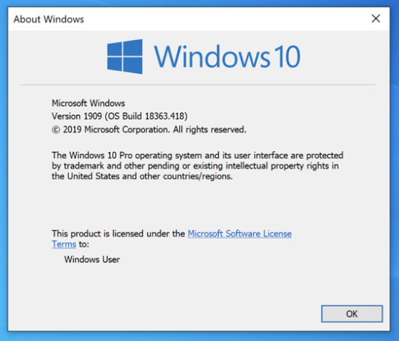
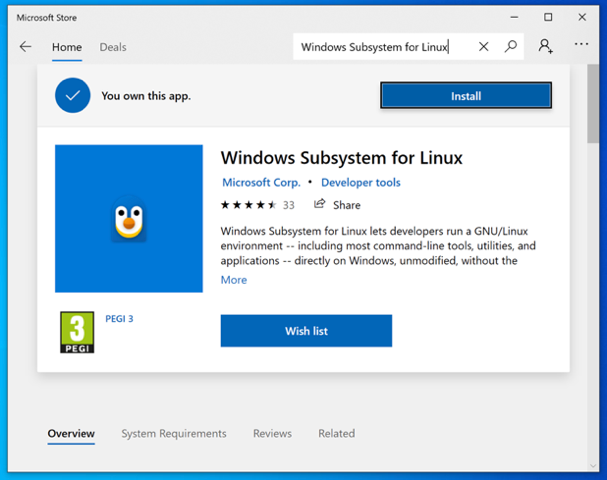

## 최신 WSL 배포판 아키텍처 (2025)

2024년 11월부터 WSL은 tar로 압축된 루트 파일시스템을 WSL로 가져올 수 있는 새로운 배포판 아키텍처를 지원합니다. 시작하려면 먼저 WSL의 프리릴리스 버전으로 업데이트 해주세요!

```
wsl --update --pre-release
```

업데이트가 완료되면 [칼리리눅스 공식](https://kali.download/wsl-images/current/) 미러에서 제공하는 `.wsl` 파일을 사용할 수 있습니다. 또는 다음 명령어로 Kali를 설치할 수도 있습니다.

```
wsl --install kali-linux
```

## WSL의 두 가지 버전

<!--
     VM setup:
     -   4x CPU
     -  8GB RAM
     - 64GB HDD
-->

Windows Subsystem for Linux(WSL)에는 [두 가지 버전](https://docs.microsoft.com/en-us/windows/wsl/compare-versions)인 "WSL 1"과 "WSL 2"가 있습니다. WSL 설치 시 **WSL 2가 권장**되며 기본 옵션입니다. 이는 WSL 2가 Hyper-V 가상 머신(WSL이 관리) 내에서 실제 Linux 커널을 사용하기 때문입니다. WSL 1은 [WINE](https://www.winehq.org/)과 유사한 "번역 계층"을 사용합니다.

{}
WSL 1에서의 "번역 계층"은 리눅스 시스템 콜(시스템 호출)을 Windows NT 커널이 이해할 수 있는 형태로 변환해주는 소프트웨어 레이어를 의미합니다. 이 계층은 리눅스 애플리케이션이 실행하려는 커널 수준 명령들을 가로채서 Windows가 이해할 수 있는 동등한 명령으로 바꿔줍니다.
{}

설치 과정이 더 간단한 Windows 11을 사용하는 것이 좋지만, Windows 10을 사용해도 가능합니다. 다만 몇 가지 추가 단계가 필요합니다.
Windows 10을 사용하는 경우 최대한 최신 업데이트를 적용해 두면 좋습니다. 특히 이 문서 작성 시점 기준으로 2022년 11월 패치가 적용되어 있으면 좋습니다.

_가상 머신에 설치하는 경우 "중첩 VM" 기능을 활성화해야 합니다 (중첩 가상화는 "VM 안의 VM"을 사용할 수 있도록 해주는 기능입니다!)._

<!--
     WSL Error: 0x80370102
     Fix for VMware Fusion: Virtual Machine -> Settings... -> Process & Memory -> Advance options -> Enable: Enable hypervisor applications in this virtual machine
-->

## 빠른 설치 방법

WSL 2에서 Kali를 실행하기 위한 권장 방법은 다음과 같습니다:

<!--
Better method?:
1. Start -> Settings -> Windows Update -> Apply any Windows updates which are available   (Want at least November 2022 patches)
   - Enable: Updates for other Microsoft products when you update Windows
   - Don't need to _upgrade_ just update Windows - and skipping optional updates!
2. Restart
3. Repeat step 1 & 2 until there is no more updates
4. wsl --install --no-distribution
   - Will install from the [Microsoft Store: Windows Subsystem for Linux](https://apps.microsoft.com/store/detail/windows-subsystem-for-linux/9P9TQF7MRM4R) (November 2022 patches)
5. Restart
6. wsl --set-default-version 2
7. wsl --install --distribution kali-linux
   - Will install from the [Microsoft Store: Kali Linux](https://apps.microsoft.com/store/detail/kali-linux/9PKR34TNCV07) (November 2022 patches)
8. Run `kali` to finish the initial setup of creating a new user

Safety net for outdated Windows 10 method:
-->

1. 관리자 명령 프롬프트를 열고 다음 명령어를 실행합니다.

```powershell
dism.exe /online /enable-feature /featurename:VirtualMachinePlatform /all /norestart
dism.exe /online /enable-feature /featurename:Microsoft-Windows-Subsystem-Linux /all
```

2. 메시지가 표시되면 재부팅합니다.
3. 다음 링크에서 WSL 2 Linux 커널을 다운로드하고 설치합니다. [aka.ms/wsl2kernel](https://aka.ms/wsl2kernel)
3. 재부팅합니다.
4. 명령 프롬프트를 열고 다음을 실행합니다.

```powershell
wsl --set-default-version 2
```

5. [Microsoft Store: Kali Linux](https://apps.microsoft.com/store/detail/kali-linux/9PKR34TNCV07)에서 설치합니다
   - **참고**: 기존에 Kali WSL 1이 설치되어 있다면 `wsl --set-version kali-linux 2` 명령으로 업그레이드할 수 있습니다!
6. `kali` 명령어를 실행하여 새 사용자 생성 등 초기 설정을 완료합니다.

## Windows 버전

Windows 11 사용자는 더 쉽게 [WSL 설치](#wsl-1-설치하기)로 바로 넘어갈 수 있습니다. 하지만 Windows 10을 사용한다면 OS 빌드/버전을 확인해야 합니다. WSL의 최소 요구 사항은 다음과 같거나 그 이상이어야 합니다.

- WSL 1: 빌드 `16215`, 버전 `1703` (2017년 6월)
- WSL 2 (x64): 빌드 `18362.1049`, 버전 `1903` (코드명: `19H1` - 2019년 5월)
  - _**권장** - 빌드 `19041`, 버전 `2004` (코드명: `20H1` - 2020년 5월)_
- WSL 2 (ARM64): 빌드 `19041`, 버전 `2004` (코드명: `20H1` - 2020년 5월)
<!-- https://devblogs.microsoft.com/commandline/wsl-2-support-is-coming-to-windows-10-versions-1903-and-1909/ -->

Windows 10 `20H1`이 권장되는 이유는 WSL 헬퍼 스크립트가 이미 사전 설치되어 있어 명령줄에서 빠르게 설치할 수 있기 때문입니다.
또한 Windows 10을 최신 버전으로 업데이트하면 WSL 헬퍼 스크립트가 Microsoft Store에서 업데이트를 가져올 수 있습니다.
Windows 11이 Windows 10보다 선호되는 이유는 아직 백포트되지 않은 내부 하드코딩된 URL 때문인데, 이는 곧 해결될 것으로 기대됩니다.

### 버전 확인

**WIN**+**R**을 누르고 `winver`를 입력하여 빌드 버전을 확인할 수 있습니다. 다음과 같은 팝업이 표시됩니다:
<!-- Can also use `ver` for CLI, but doesn't give all the same information - `systeminfo` gives too much -->



여기서 **OS 빌드** 뒤에 오는 숫자를 확인합니다.
우리의 빌드는 `18363` _(마이너 빌드: `418`)_입니다. 이는 WSL 1 또는 WSL 2를 사용할 수 있다는 의미입니다 (단, 수동 설정이 필요합니다)!

<!--
### Check patches

TODO: systeminfo to see what patches applied
-->

## WSL 1 설치하기

Windows의 "옵션 기능"을 통해 WSL을 활성화하는 것은 필수 요구사항입니다. 하지만 필요에 따라 [Microsoft Store: Windows Subsystem for Linux](#wsl-in-microsoft-store)를 사용하여 WSL을 업데이트하면 기능 확장 및 버그 수정을 받을 수 있습니다.

WSL(WSL 1 또는 WSL 2)을 설치하는 방법은 여러 가지가 있습니다:

- [WSL 헬퍼 스크립트](#wsl-헬퍼-스크립트) (**가장 간단**)
  - _Windows 10 `20H1` (빌드: `19041`, 버전: `2004`) 이상 필요_
  - WSL 2도 함께 설치됨
  - _2022년 11월 패치가 적용되면 더 나은 경험 제공_ <!-- due to it pulling updates from the Microsoft store to be the most up-to-date -->
- [Dism](#dism) (**권장**)
- [PowerShell](#powershell)

Windows 버전과 패치 상태에 따라 설치 경험이 달라질 수 있습니다.

### WSL 헬퍼 스크립트

이 방법이 가장 쉽지만, Windows 10 `20H1` (빌드: `19041`, 버전: `2004`) 이상이 필요합니다. 그렇지 않으면 이 방법을 시도할 때 `'wsl'은(는) 내부 또는 외부 명령, 실행할 수 있는 프로그램, 또는 배치 파일이 아닙니다.`라는 오류가 발생합니다.
<!-- This is because WSL 2 was back ported for older Windows versions, and was initially released for this version which is why older versions are supported, but this command is not offered -->

WSL 헬퍼 스크립트 방식은 (다른 방법과 달리) WSL과 Kali를 모두 설치합니다. WSL 1과 WSL 2를 모두 지원하므로, Hyper-V VM을 활성화하고 WSL 커널을 설정합니다.
단점은 **2022년 11월 패치 이전의 Windows 10**을 사용하는 경우, 알려진 문제로 인해 **이전 버전의 Kali**(Kali 2019.2)가 WSL에 설치된다는 것입니다.
[2022년 11월 패치](https://devblogs.microsoft.com/commandline/the-windows-subsystem-for-linux-in-the-microsoft-store-is-now-generally-available-on-windows-10-and-11/)를 적용하면 헬퍼 스크립트가 Microsoft Store([WSL](#wsl-in-microsoft-store)과 [Kali](#kali-in-microsoft-store) 모두)에서 업데이트를 가져올 수 있게 됩니다.
<!-- wrapper/helper-script which gets replaced with the 'real' program on install -->

관리자 명령 프롬프트에서 다음 명령을 실행하면 WSL이 설치되지 않은 경우 WSL을 설정하고 [Kali WSL을 설치](#kali-wsl-설치하기)합니다:
<!-- Don't need admin with November 2022, will prompt to upgrade -->

```powershell
C:\Windows\system32>wsl --install --distribution kali-linux
Installing: Virtual Machine Platform
Virtual Machine Platform has been installed.
Installing: Windows Subsystem for Linux
Windows Subsystem for Linux has been installed.
Downloading: WSL Kernel
Installing: WSL Kernel
WSL Kernel has been installed.
Downloading: Kali Linux Rolling
The requested operation is successful. Changes will not be effective until the system is rebooted.

C:\Windows\system32>
```

<!--
    List which distribution possibilities:
    C:\Windows\system32> wsl --list --online

    Will pull Ubuntu down by default. November 2022 allows for:
    C:\Windows\system32> wsl --install --no-distribution
-->

시스템을 재부팅하고 로그인하면 모든 것이 성공적으로 진행되었다면 터미널 창이 열릴 것입니다:

```plaintext
Installing, this may take a few minutes...
Please create a default UNIX user account. The username does not need to match your Windows username.
For more information visit: https://aka.ms/wslusers
Enter new UNIX username:
```

사용자를 설정하면 다음과 같이 진행됩니다:

```console
Enter new UNIX username: kali
New password:
Retype new password:
passwd: password updated successfully
Installation successful!
kali@DESKTOP-AJVAG8O:~$ uname -a
Linux DESKTOP-AJVAG8O 5.10.16.3-microsoft-standard-WSL2 #1 SMP Fri Apr 2 22:23:49 UTC 2021 x86_64 GNU/Linux
kali@DESKTOP-AJVAG8O:~$
```

**참고**: 비밀번호 입력 시 아무것도 표시되지 않습니다.

_2022년 11월 패치 이전의 Windows 10에서는 알려진 문제로 인해 이 방법을 사용하면 오래된 버전의 Kali(Kali 2019.2)가 WSL에 설치될 수 있습니다. 이 경우 Microsoft Store에서 Kali를 [재설치](#install-kali-wsl)하는 것이 좋습니다. Windows 11을 포함한 최신 버전에서는 이 문제가 없습니다._
<!-- https://github.com/microsoft/WSL/pull/8774 -->

### Dism

관리자 명령 프롬프트에서 다음 명령을 실행합니다:

_나중에 WSL 2를 사용하려면, 첫 번째 명령에서 `VirtualMachinePlatform`을 지금 포함시킵니다. 이는 WSL 1에는 필요하지 않으며, 명령에서 제외할 수 있습니다._

```powershell
C:\Windows\system32>dism.exe /online /enable-feature /featurename:VirtualMachinePlatform /all /norestart

Deployment Image Servicing and Management tool
Version: 10.0.18362.1

Image Version: 10.0.18363.418

Enabling feature(s)
[==========================100.0%==========================]
The operation completed successfully.

C:\Windows\system32>
C:\Windows\system32>dism.exe /online /enable-feature /featurename:Microsoft-Windows-Subsystem-Linux /all

Deployment Image Servicing and Management tool
Version: 10.0.18362.1

Image Version: 10.0.18363.418

Enabling feature(s)
[==========================100.0%==========================]
The operation completed successfully.
Restart Windows to complete this operation.
Do you want to restart the computer now? (Y/N)
```

메시지가 표시되면 재부팅하세요!

이제 [Kali WSL을 설치](#kali-wsl-설치하기)하거나 [WSL 2로 업그레이드](#wsl-1에서-wsl-2로-수동-업그레이드)할 수 있습니다.

### PowerShell

관리자 권한으로 PowerShell 프롬프트를 열고 다음 명령을 실행하여 옵션 기능에서 설치합니다:

_나중에 WSL 2를 사용하려면, `VirtualMachinePlatform`도 함께 포함시킵니다. 이는 WSL 1에는 필요하지 않으며, 명령에서 제외할 수 있습니다._

```powershell
PS C:\Windows\system32> Enable-WindowsOptionalFeature -Online -FeatureName Microsoft-Windows-Subsystem-Linux,VirtualMachinePlatform
Do you want to restart the computer to complete this operation now?
[Y] Yes  [N] No  [?] Help (default is "Y"):
```

메시지가 표시되면 재부팅하세요!

이제 [Kali WSL을 설치](#kali-wsl-설치하기)하거나 [WSL 2로 업그레이드](#wsl-1에서-wsl-2로-수동-업그레이드)할 수 있습니다.

<!--

### GitHub

https://github.com/microsoft/WSL/releases

-->

## WSL 1에서 WSL 2로 수동 업그레이드

**VM 플랫폼**:

[PowerShell](#powershell) 또는 [Dism](#dism)으로 WSL을 설치했다면, 이미 `VirtualMachinePlatform` 기능(Hyper-V)이 설치되어 있을 수 있습니다.
그렇지 않다면 [관리자 권한으로](#dism) `dism.exe /online /enable-feature /featurename:VirtualMachinePlatform /all /norestart`를 실행해야 합니다.

**WSL Linux 커널**:

다음으로 WSL Linux 커널 업데이트를 수동으로 설치해야 합니다. 다음에서 다운로드할 수 있습니다:

- [wsl_update_x64.msi](https://wslstorestorage.blob.core.windows.net/wslblob/wsl_update_x64.msi)
- [wsl_update_arm64.msi](https://wslstorestorage.blob.core.windows.net/wslblob/wsl_update_arm64.msi)
<!-- https://learn.microsoft.com/en-gb/windows/wsl/install-manual -->

(관리자 권한으로) 설치한 후 시스템을 재부팅합니다.

**WSL 기본 버전**:

이제 명령 프롬프트에서 다음을 실행하여 **이 시점 이후에** 설치되는 모든 WSL 배포판을 WSL 2로 설정할 수 있습니다:

```powershell
C:\Users\Win>wsl --set-default-version 2
For information on key differences with WSL 2 please visit https://aka.ms/wsl2
The operation completed successfully.

C:\Users\Win>wsl --install --distribution kali-linux
[...]
```

<!--
     Check by:
     PS C:\Users\Win> Get-ItemPropertyValue `
     >>       -Path HKCU:\SOFTWARE\Microsoft\Windows\CurrentVersion\Lxss `
     >>       -Name DefaultVersion
     2
     PS C:\Users\Win>
-->

이제 Kali를 설치하면 WSL 2 버전으로 설치됩니다.

**WSL 배포판 업그레이드**:

그러나 이전에 Kali WSL 1을 설치한 경우 다음과 같이 업그레이드할 수 있습니다:

```powershell
C:\Users\Win>wsl --list --verbose
  NAME          STATE           VERSION
* kali-linux    Stopped         1

C:\Users\Win>
C:\Users\Win>wsl --set-version kali-linux 2
Conversion in progress, this may take a few minutes...
For information on key differences with WSL 2 please visit https://aka.ms/wsl2
Conversion complete.

C:\Users\Win>
C:\Users\Win>wsl --list --verbose
  NAME          STATE           VERSION
* kali-linux    Stopped         2

C:\Users\Win>
C:\Users\Win>kali
[...]
```

완료되었습니다!

## Microsoft Store에서의 WSL

이 방법은 WSL을 [설치](#dism)하는 것이 아니라 업데이트하는 것이므로, Microsoft의 Windows Subsystem Linux 옵션 기능이 활성화되어 있어야 합니다.
Microsoft Store를 사용하면 Windows 업데이트 주기("패치 화요일") 외에도 [업데이트가 배포](https://devblogs.microsoft.com/commandline/a-preview-of-wsl-in-the-microsoft-store-is-now-available/)되므로 항상 최신 버전을 유지할 수 있습니다.
<!--
  > This application requires the Windows Subsystem for Linux Optional Component.
  > The system may need to be restarted so the changes can take effect.
  > Press any key to continue...
-->

이 기능을 사용하려면 Windows가 최신 상태(OS 업그레이드가 아닌 업데이트 패치 적용)인지 확인해야 합니다.
<!--
  Its one thing to install from WSL store, but also then running the program does another version check.
  - Install: It does require Windows 10 `20H1` (Build: `19041`, Version: `2004`) or higher.
    Store -> WSL -> System Requirements: Windows 10 version 19041.0 or higher
  - Run: November 2022 patches - KB5020030 (November 15, 2022)
    https://www.catalog.update.microsoft.com/Search.aspx?q=%20(KB5020030)
    > Windows version 10.0.19045.2006 does not support the packaged version of Windows Subsystem for Linux.
    > Install the required update via Windows update or via: https://aka.ms/store-wsl-kb-win10
    > For information please visit https://aka.ms/wslinstall
    > Error code: Wsl/WSL_E_OS_NOT_SUPPORTED
    > Press any key to continue...
-->

_Windows 10 사용자는 2022년 11월 패치가 적용된 경우 `wsl --install` 명령이 Microsoft Store([WSL](#microsoft-store에서의-wsl)과 [Kali](#microsoft-store의-kali) 모두)에 대한 바로가기가 됩니다._


옵션 기능을 활성화한 후 [Microsoft Store](https://apps.microsoft.com/store/detail/windows-subsystem-for-linux/9P9TQF7MRM4R)로 이동하여 `Windows Subsystem for Linux`를 검색하고 "설치"를 클릭합니다:



_로그인은 필수가 아닙니다. 설치 중에 UAC 프롬프트가 표시될 수 있습니다._

다운로드 및 설치가 완료되면 재부팅해야 합니다.

이제 WSL 1을 사용할 준비가 되었습니다. WSL 2를 사용하려면 [Hyper-V 및 WSL 커널 활성화](#wsl-1에서-wsl-2로-수동-업그레이드)가 필요합니다.

## Kali WSL 설치하기

WSL 1 또는 WSL 2 설정이 완료되면 다음과 같은 방법으로 WSL에 Kali를 설치할 수 있습니다:

- [Microsoft Store](#microsoft-store의-kali) (**권장** & **가장 최신**)
- [WSL 헬퍼 스크립트](#wsl-헬퍼-스크립트-(--install)) (**가장 간단**)
- [rootfs 가져오기](#rootfs-가져오기)
- [AppxBundle 가져오기](#appxbundle-가져오기)

**참고**: 설치 방법을 전환하기 위해 덮어쓰기를 시도하는 것은 권장되지 않습니다. 먼저 `wsl --unregister kali-linux`를 실행하세요.

### Microsoft Store의 Kali

그래픽 인터페이스가 있는 [Microsoft Store](https://apps.microsoft.com/store/detail/kali-linux/9PKR34TNCV07)를 사용하거나 PowerShell을 통해 직접 다운로드할 수 있습니다.

_Windows 10 사용자는 2022년 11월 패치가 적용된 경우 `wsl --install` 명령이 Microsoft Store([WSL](#microsoft-store에서의-wsl)과 [Kali](#microsoft-store의-kali) 모두)에 대한 바로가기가 됩니다._

[Microsoft Store: Kali Linux](https://apps.microsoft.com/store/detail/kali-linux/9PKR34TNCV07)로 이동하여 "설치"를 클릭합니다.
다운로드가 완료되면 "실행"을 클릭하여 새 사용자 생성 등 설치를 마무리합니다:

```powershell
Installing, this may take a few minutes...
Please create a default UNIX user account. The username does not need to match your Windows username.
For more information visit: https://aka.ms/wslusers
Enter new UNIX username: kali
New password:
Retype new password:
passwd: password updated successfully
Installation successful!
┏━(Message from Kali developers)
┃
┃ This is a minimal installation of Kali Linux, you likely
┃ want to install supplementary tools. Learn how:
┃ ⇒ https://www.kali.org/docs/troubleshooting/common-minimum-setup/
┃
┗━(Run: "touch ~/.hushlogin" to hide this message)
┌──(kali㉿DESKTOP-AJVAG8O)-[~]
└─$ uname -a
Linux DESKTOP-AJVAG8O 5.10.16.3-microsoft-standard-WSL2 #1 SMP Fri Apr 2 22:23:49 UTC 2021 x86_64 GNU/Linux

┌──(kali㉿DESKTOP-AJVAG8O)-[~]
└─$ id
uid=1000(kali) gid=1000(kali) groups=1000(kali),4(adm),24(cdrom),27(sudo),30(dip),46(plugdev),100(users)

┌──(kali㉿DESKTOP-AJVAG8O)-[~]
└─$ grep VERSION= /etc/*release
VERSION="2023.1"

┌──(kali㉿DESKTOP-AJVAG8O)-[~]
└─$
```

**참고**: 비밀번호 입력 시 아무것도 표시되지 않습니다.

#### 스토어 + PowerShell

더 빠른 방법은 다음과 같이 실행하는 것입니다:

```powershell
PS C:\Users\Win> Invoke-WebRequest -Uri https://aka.ms/wsl-kali-linux-new -OutFile .\kali-linux.AppxBundle -UseBasicParsing -TimeoutSec 1800
PS C:\Users\Win>
PS C:\Users\Win> Add-AppxPackage .\kali-linux.AppxBundle
```

<!-- If you use `https://aka.ms/wsl-kali-linux`, you get the outdated version - which is what Windows 10 without using the store (v1.1.4.0) -->

### WSL 헬퍼 스크립트 (--install)

_2022년 11월 패치 이전의 Windows 10에서는 알려진 문제로 인해 이 방법을 사용하면 오래된 버전의 Kali(Kali 2019.2)가 WSL에 설치될 수 있습니다. Microsoft Store 방식을 사용하는 것이 좋습니다. Windows 11을 포함한 최신 버전에서는 이 문제가 없습니다._
<!-- https://github.com/microsoft/WSL/pull/8774 -->

명령 프롬프트에서 다음을 실행합니다:

```
C:\Users\Win>wsl --install --distribution kali-linux
Downloading: Kali Linux Rolling
Installing: Kali Linux Rolling
Kali Linux Rolling has been installed.
Launching Kali Linux Rolling...

C:\Users\Win>
```

[이전처럼](#wsl-helper-script) 터미널 창이 열릴 것입니다:

```
Installing, this may take a few minutes...
Please create a default UNIX user account. The username does not need to match your Windows username.
For more information visit: https://aka.ms/wslusers
Enter new UNIX username: kali
New password:
Retype new password:
passwd: password updated successfully
Installation successful!
kali@DESKTOP-AJVAG8O:~$ uname -a
Linux DESKTOP-AJVAG8O 5.10.16.3-microsoft-standard-WSL2 #1 SMP Fri Apr 2 22:23:49 UTC 2021 x86_64 GNU/Linux
kali@DESKTOP-AJVAG8O:~$
kali@DESKTOP-AJVAG8O:~$ id
uid=1000(kali) gid=1000(kali) groups=1000(kali),4(adm),24(cdrom),27(sudo),30(dip),46(plugdev)
kali@DESKTOP-AJVAG8O:~$
kali@DESKTOP-AJVAG8O:~$ grep VERSION= /etc/*release
/etc/os-release:VERSION="2019.2"
kali@DESKTOP-AJVAG8O:~$
```

**참고**: 비밀번호 입력 시 아무것도 표시되지 않습니다.

### rootfs 가져오기

WSL에 가져올 수 있는 rootfs를 생성하기 위해 [WSL 빌드 스크립트](https://gitlab.com/kalilinux/build-scripts/kali-wsl-app)를 사용할 수 있습니다.
rootfs 생성 방법은 이 가이드의 범위를 벗어나므로 이미 생성되었다고 가정합니다.

먼저 rootfs 파일을 머신으로 복사합니다:

```powershell
C:\Users\Win\Downloads>dir
[...]
05/04/2023  21:12    <DIR>          .
05/04/2023  21:12    <DIR>          ..
05/04/2023  21:11       217,859,650 kali-linux-rolling-wsl-rootfs-amd64.tar.gz
               1 File(s)    217,859,650 bytes
               2 Dir(s)  40,346,128,384 bytes free

C:\Users\Win\Downloads>
C:\Users\Win\Downloads>wsl --list --verbose
Windows Subsystem for Linux has no installed distributions.
Distributions can be installed by visiting the Microsoft Store:
https://aka.ms/wslstore
C:\Users\Win\Downloads>
```

다음으로 rootfs를 가져옵니다. 여기서는 `kali-wsl`이라는 이름을 부여하고, 데이터를 `./wsl-test`에 저장하며, `.\kali-linux-rolling-wsl-rootfs-amd64.tar.gz`에서 가져옵니다:

```powershell
C:\Users\Win\Downloads>wsl --import kali-wsl  wsl-test  .\kali-linux-rolling-wsl-rootfs-amd64.tar.gz
C:\Users\Win\Downloads>
C:\Users\Win\Downloads>dir
[...]
05/04/2023  21:13    <DIR>          .
05/04/2023  21:13    <DIR>          ..
05/04/2023  21:11       217,859,650 kali-linux-rolling-wsl-rootfs-amd64.tar.gz
05/04/2023  21:13    <DIR>          wsl-test
               1 File(s)    217,859,650 bytes
               3 Dir(s)  39,582,310,400 bytes free

C:\Users\Win\Downloads>
```

마지막으로 사용해봅시다:

```powershell
C:\Users\Win\Downloads>wsl --list --verbose
  NAME          STATE           VERSION
* kali-wsl      Stopped         2

C:\Users\Win\Downloads>
C:\Users\Win\Downloads>wsl --distribution kali-wsl
┏━(Message from Kali developers)
┃
┃ This is a minimal installation of Kali Linux, you likely
┃ want to install supplementary tools. Learn how:
┃ ⇒ https://www.kali.org/docs/troubleshooting/common-minimum-setup/
┃
┗━(Run: "touch ~/.hushlogin" to hide this message)
┌──(root㉿DESKTOP-AJVAG8O)-[/mnt/c/Users/Win/Downloads]
└─# uname -a
Linux DESKTOP-AJVAG8O 5.10.16.3-microsoft-standard-WSL2 #1 SMP Fri Apr 2 22:23:49 UTC 2021 x86_64 GNU/Linux

┌──(root㉿DESKTOP-AJVAG8O)-[/mnt/c/Users/Win/Downloads]
└─# id
uid=1000(kali) gid=1000(kali) groups=1000(kali),4(adm),24(cdrom),27(sudo),30(dip),46(plugdev),100(users)

┌──(root㉿DESKTOP-AJVAG8O)-[/mnt/c/Users/Win/Downloads]
└─#
```

### AppxBundle 가져오기

WSL로 가져올 수 있는 WSL 앱을 생성하기 위해 [WSL 빌드 스크립트](https://gitlab.com/kalilinux/build-scripts/kali-wsl-rootfs)를 사용할 수 있습니다.
AppxBundle 생성 방법은 이 가이드의 범위를 벗어나므로 이미 생성되었다고 가정합니다.

자체 서명 인증서이므로 `Install.ps1`을 실행하여 머신을 설정합니다.

<!--
## Update Kali WSL

How to fix 2019.2 to latest
-->

## Kali WSL 실행하기

모든 설정과 설치가 완료되면 다음과 같은 방법으로 Kali를 실행할 수 있습니다:

- 명령 프롬프트: `kali` (단축키)
- 명령 프롬프트: `wsl --distribution kali-linux`
- 명령 프롬프트: `wsl` (OS가 기본값으로 설정된 경우: `wsl --setdefault kali-linux`) <!-- Able to tell by by the asterisk by the name with wsl --list -->
- 시작 메뉴: `Kali Linux`
- Windows Terminal (설치된 경우)

## 문제 해결

이런... 문제가 발생했나요? 당황하지 말고 침착하게 아래 내용들을 읽어보면서 해결해보아요!

- 시스템 아키텍처가 무엇인가요?
  - x64/x86_64/AMD64? ARM64?
- Windows 에디션은 무엇인가요?
  - 윈도우 10 Home? 윈도우 11 Pro?
- Windows 버전은 무엇인가요?
  - `winver`로 확인
- Windows OS 빌드는 무엇인가요?
  - `winver`로 확인
- 어떤 버전의 WSL을 시도하고 있나요?
  - WSL 1? WSL 2?
- 어떤 버전의 WSL을 원하시나요?
  - WSL 1? WSL 2?
- WSL 2인 경우, BIOS/UEFI에서 가상화가 허용되어 있나요?
  - 매뉴얼 확인
- WSL 2인 경우, `VirtualMachinePlatform`이 설치되어 있나요?
  - `PS C:\Windows\system32> Get-WindowsOptionalFeature -Online | Where-Object {$_.FeatureName -eq "VirtualMachinePlatform"} | Format-Table`로 확인해봅시다.
- WSL 2인 경우, WSL 커널이 설치되어 있나요?
  - `PS C:\Users\win> Get-WmiObject -Class Win32_Product | Where-Object {$_.Name -eq "Windows Subsystem for Linux Update"}`로 확인해봅시다.
- WSL 업데이트가 있나요?
  - `wsl --update`로 확인
- 사용 중인 WSL 버전은? WSL이 제대로 작동하나요?
  - `wsl --status`로 확인
  - `wsl --version`으로 확인 (최신 WSL 버전에서만 사용 가능) <!-- November 2022 -->
- Kali WSL을 어떻게 설치하려고 하시나요?
  - 스토어? WSL 헬퍼 스크립트? 옵션 기능?
- 오류 메시지가 있나요?
  - 오류 코드 확인
- 예상 결과는? 실제 결과는? 어느 시점에서 문제가 발생했나요?
  - 단계 및 출력 확인
